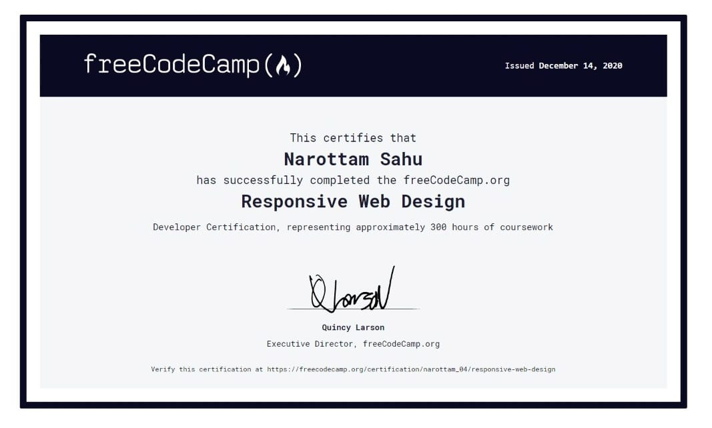
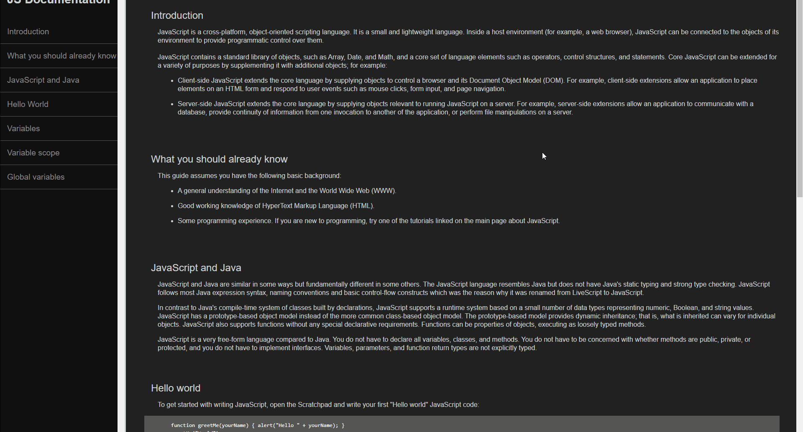

# Freecodecamp Responsive Web design

Static websites made by me for the Freecodecamp Curriculum
 
course link 👉 [click here](https://www.freecodecamp.org/learn/)

# Certificate

👉 https://www.freecodecamp.org/certification/narottam_04/responsive-web-design

 

 

## 1) Tribute Website

---

 

 

## 2) Survey form

---

 

 

## 2) Survey form

---

 

 

## 3) Product Landing Page

---

 

 

## 4) Technical Documentation Form

---

 

 

## 5) Portfolio Website

---

 

 
